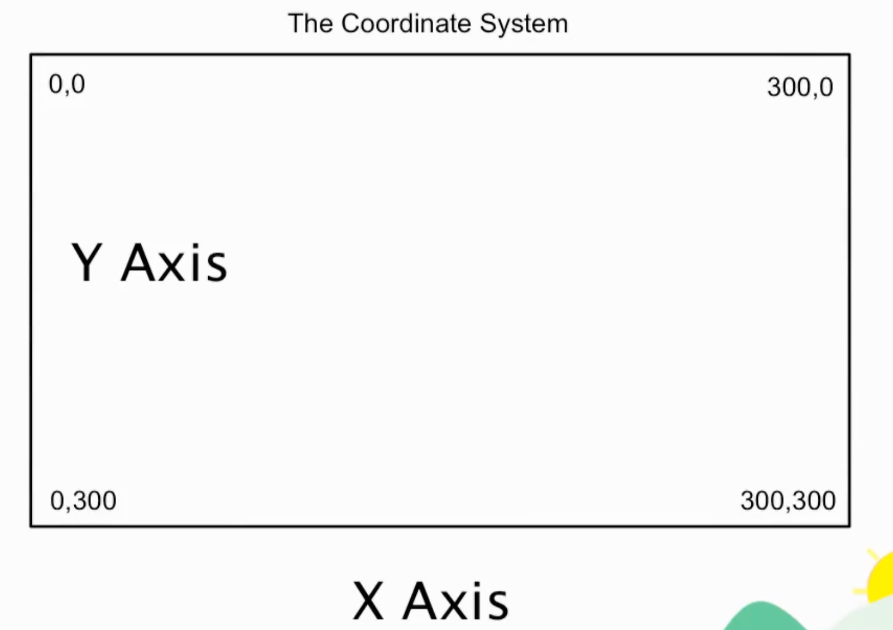

# D3 Notes

### `References`

1. [D3 CDN](https://d3js.org/)

### `Topics`

1. Introduction to D3.js
2. SVG Objects
3. SVG Coordinate System
4. Drawing Shapes
5. Chaining Syntax

### `Introduction to D3.js`

Data Driven Documents
* D3 is a JavaScript library that also works with HTML5 and CSS3 standards
* Takes data and visualizes it using HTML, CSS, and JavaScript
* Created in 2011

### `SVG Objects`

**SVG is a D3 Foundational Element**
* SVG scalable vector graphics
* SVG is an XML based vector image format
* For creating graphics on the web
* A standard that was adopted by W3C in 1999
* SVG came out with HTML5 as a way to draw shapes on the web with HTML
* Without having to take an image to display on the page
* Renders image using HTML CSS JS
* We have .SVG images
* .jpeg .gif .png are called raster images
* Raster images become distorted
* SVG is rendered with the browser and HTML
* SVG creates images that are clear and that scale does not distort

**SVG are** 
1. Shapes that define them (circles, line, bar, etc)
2. Filters (blur, drop shadow)
3. Gradients (paint svg objects)

* Can use SVG element in HTML5

**D3 a way to create SVG elements with JavaScript but also**
1. make calls to other API's or systems
2. pull in data from external sources
3. accomplish thing in a dynamic way

### `SVG Coordinate System`

The coordinate system starts from top left

### `Drawing Shapes`

* Can use SVG html elements
* Can use d3 library to append svg element with JavaScript
* Rectangle needs width and height specified
* Circles you also have to specify the svg view port coordinate
* You append the elements using select tag

### `D3 Principles`

* `.select()` | Select element
* `.append()` | Add new svg and shape
* `.attr()` | Set attr like width and height
* `.style()` | Set style

**Chaining Syntax**

* New when chaining
* Minifying will get rid of white space

### `Drawing with Data`

* Can pass dataset to .data() method
* Can use anonymous functions to help draw
* Use width and height variables to help draw