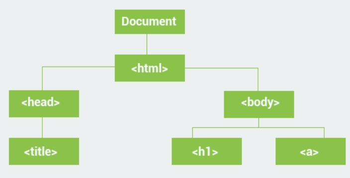
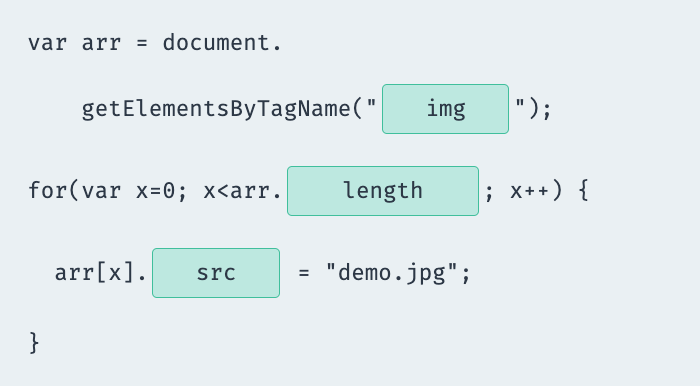

# Document Object Model Notes

### Topics

1. DOM Tree
2. The Document Object
3. Selecting Elements
4. Changing Attributes of HTML elements with JS DOM
5. Changing Style HTML elements with JS DOM

---

### DOM Tree

* Document Object Model Tree.
* Browser builds the Document Object Model for a webpage that is rendered.
* DOM represents a document as a tree structure.
* All nodes in tree have some kind of relationship among each other.



* Nodes on the same tree level are called siblings.

---

### The Document Object

* There is a predefined document object in JavaScript, which can be used to access all elements on the DOM.
* The document object is the owner (or **root**) of all object in your webpage.
* If you want to access objects in an HTML page, you always start with accessing the document object.

##### Example:
``` javascript
document.body.innerHTML = "Some text"; // Body is an element of document object
```

* The innerHTML **property** can be used on almost all HTML elements to change its content.
* The document object is the root of the DOM.

---

### Selecting Elements

* All HTML elements are objects.
* Every object has properties and methods.
* The document object has methods that allow you to select the desired HTML element.
* These three methods are the most commonly used for selecting HTMl elements:

```javascript
//finds element by id
document.getElementById(id) 

//finds elements by class name
document.getElementsByClassName(name) 

//finds elements by tag name
document.getElementsByTagName(name)

//example
let ob = document.getElementById("text");
ob.innerHTML = "Hi";
```

* `getElementsByClassName()` method returns a collection of all elements in the document with the specified class name.
* `getElementsByTagName()` method returns all of the elements of the specified tag name as an array.

---

### Changing Attributes of HTML elements with JS DOM

* You can access HTML elements with the document object and change their attributes.

```javascript


//get image element object with id "myimg" and set the image to "apple.png"
<script>
    let imageElement = document.getElementById("myimg");
    imageElement.src = "apple.png";
</script>

//make sure HTML is loaded
window.onload = function() {
    //get all anchor elements and set it to this variable
    let anchorElements = document.getElementsByTagName('a');
    //set the first anchor tags href to "sololearn.com"
    anchorElements[0].href= 'http://www.sololearn.com';
};
```



---

### Changing Style of HTML elements with JS DOM

* You can access HTML elements with the document object and change their style.
* CSS properties must be referred to in camel case.

```javascript
    var x = document.getElementById("demo");
    x.style.color = '#6600FF';
    x.style.width = '100px';
    x.style.backgroundColor = 'lightblue';
```
---

### Summary

* HTML elements are HTML objects under the DOM concept.
* You can access HTML objects through the built in document object.
* You can initialize dom objects, HTML objects, to a variable.
* You can change attribute values of a HTML elements by using the . dot notation.
* You can change the style of HTML elements by using the . dot notation.
