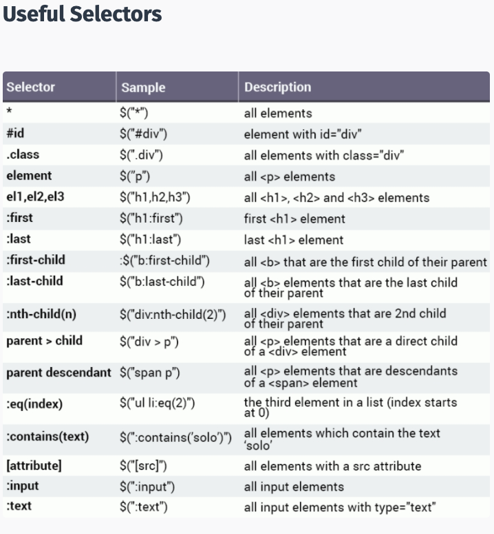

# jQuery Research Notes

### References

1. [Google CDN](https://developers.google.com/speed/libraries#jquery)
2. [Minifier](https://www.minifier.org/)
3. [jQuery Effect Methods](https://www.w3schools.com/jquery/jquery_ref_effects.asp)

### Topics

1. Introduction to jQuery
2. Getting Started
3. Syntax
4. Selectors Examples

### Introduction to jQuery

* You need to add jQuery to project.
* You can add it with CDN script tag like bootstrap.
* You need to add the CDN script tag above the "main.js"
* jQuery is a JavaScript library, so it has the .js file extension.
* JavaScript and jQuery can accomplish the same task. 
* However, with jQuery, you can make make code much more shorter and easily readable.
* For Example:

JavaScript:

```javascript
var el = document.getElementById("start");
el.innerHTML = "Go";
```

Versus, jQuery:

```javascript
$("#start").html("Go");
```


* You can download a copy of the jQuery library from www.jquery.com
* You can include jQuery from a CDN (Content Delivery Network), like Google or Microsoft or the official jQuery website:

```javascript
<script src = "https://code.jquery.com/jquery-3.1.1.js"></script>
```

### Getting Started

* Best practice: wait for the HTML document to be loaded before working with jQuery.
* Use the `ready` event of the document object:

```javascript
$(document).ready(function() {
    // ┌───────────────────┐
    // │ jQuery code here  │	
    // └───────────────────┘
})

// This line of code accesses the document object and defines
// a function to be called when the document's ready event is fired.

```

* The `$` is used to access jQuery.
* The code above is very common, therefore, there is a shorthand version:


```javascript
$(function() {
    // ┌───────────────────┐
    // │ jQuery code here  │	
    // └───────────────────┘
})
```

### Syntax

* jQuery is used to select (query) HTML elements and perform "actions" on them.
* Basic syntax is: `$("selector").action()
  1. The `$` accesses jQuery.
  2. The (selector) finds HTML elements.
  3. The action() is then performed on the element(s).

##### Examples:
```javascript
$("p").hide() // hides all <p> elements
$(".demo").hide() // hides all elements with class = "demo"
$("#demo").hide() // hides the element with id="demo"
$("#start").html("Go!"); // Selects element with id start and calls the html() function for it.
// The html function is used to change the HTML content of an element.
```

### Selectors Examples

* jQuery selectors start with the dollar sign and parentheses: `$()`
* Selectors make accessing HTML DOM elements easy compared to pure JavaScript.

```javascript
$("div") // selects all <div> elements
$("#test") // selects the element with the id = "test"
$(".menu") // selects all elements with class = "menu"
$("div.menu") // all <div> elements with class = "menu"
$("p:first") // the first <p> element
$("h1, p") // all <h1> and all <p> elements
$("div p") // all <p> elements that are descendants of a <div> element
$("*") // all elements of the DOM
$("p a") // select all <a> links which are inside paragraph tags.
$("div > *") // select all elements that are children of div
$("h1, h2") // select all h1 and h2 elements
$("#demo p") // select all p elements with the id="demo"
```

##### More Selectors



### Minifying Code

* Helps make code run faster

### Practice Example

```javascript
// Wait till document is ready before calling this code
// If you add script tag at bottom of document, this is not needed
$(document).ready(function() {

    // ┌─────────────────────────────────────────────┐
    // │   Use . notation to access jQuery Methods   │	
    // └─────────────────────────────────────────────┘

    // ┌──────────────────────────────────────────────────┐
    // │   Change h1 color to red using the .css method   │	
    // └──────────────────────────────────────────────────┘
    // If only first inputs then get
    // If two inputs then set
    // $("h1").css("color", "green");

    // Selects all buttons
    $("button").css("color", "blue");

    // ┌───────────────────────────────────────────────┐
    // │   Change elements styling by adding a class   │	
    // └───────────────────────────────────────────────┘
    $("h1").addClass("big-title margin-50");

    // ┌─────────────────────────────────────────────────┐
    // │   Change elements styling by removing a class   │	
    // └─────────────────────────────────────────────────┘
    //$("h1").removeClass("big-title");

    // ┌──────────────────────────────────┐
    // │   Check if element has a class   │	
    // └──────────────────────────────────┘
    //$("h1").hasClass("margin-50"); // Returns true

    // ┌─────────────────────────────┐
    // │   Change the elements text  │	
    // └─────────────────────────────┘
    $("h1").text("Bye");

    // ┌────────────────────────────────────┐
    // │   Change the text on the buttons   │	
    // └────────────────────────────────────┘
    $("button").text("Don't Click Me");

    // ┌────────────────────────────────────────────┐
    // │   Change the text by adding html elements  │	
    // └────────────────────────────────────────────┘
    $("button").html("<em>Hey</em>");

    // ┌────────────────────────────────────────┐
    // │   Manipulate attributes using jQuery   │	
    // └────────────────────────────────────────┘
    $("a").attr("href", "https://www.yahoo.com");

    // ┌─────────────────────────────────────────┐
    // │   Adding Event Listeners using jQuery   │	
    // └─────────────────────────────────────────┘
    // Click listener for H1
    $("h1").click(function() {
        $("h1").css("color", "purple");
    })

    // Click listener for button
    $("button").click(function() {
        $("h1").css("color", "purple");
    })

    // With Out jQuery
    // for(let i = 0; i < 5; i++){
    //     document.querySelectorAll("button")[i].addEventListener("click", function() {
    //         document.querySelector("h1").style.color = "purple";
    //     })
    // }

    // Listen to keys typed on input
    $("input").keypress(function(event){
        console.log(event.key);
    })

    // Listen to all keys
    $(document).keypress(function(event){
        console.log(event.key);
    })

    // Show key in h1
    $(document).keypress(function(event){
        $("h1").text(event.key);
    })

    // Instead of .keypress or .click you can use .on("")
    // Event and callback function (function() {// What to do when event occurs})
    $("h1").on("mouseover", function(){
        $("h1").css("color", "blue");
    })

    // ┌──────────────────────────────────┐
    // │   Adding elements using jQuery   │	
    // └──────────────────────────────────┘
    // Create a button element before the h1 element (outside h1)
    $("h1").before("<button>Before New Button</button>");

    // Create a button element after the h1 element (outside h1)
    $("h1").after("<button>After New Button</button>");

    // Create just after the opening tag (Inside h1)
    $("h1").prepend("<button>Prepend New Button</button>");

    // Create just before the ending tag (Inside h1)
    $("h1").append("<button>Append New Button</button>");

    // Get rid of all the elements
    //$("button").remove();
    $("input").after("<br><br><button id=\"remove-button\">Remove All Buttons</button>");
    $("#remove-button").on("click", function(){
        $("button").remove();
    });

    // ┌────────────────────────────────────┐
    // │   Adding animations using jQuery   │	
    // └────────────────────────────────────┘
    //let isVisible = true;
    $("#remove-button").after("<br><br><button id=\"hide-button\">Toggle H1</button>");
    $("#hide-button").on("click", function(){
        $("h1").slideUp().slideDown().animate({opacity: 0.5});

        // if(isVisible){
        //     $("h1").hide();
        //     $("#hide-button").text("Show h1")
        //     isVisible = false;
        // }else{
        //     $("h1").show();
        //     $("#hide-button").text("Hide h1")
        //     isVisible = true;
        // }
    });

    // .fadeOut()
    // .fadeIn()
    // .fadeToggle()

    // .slideOut()
    // .slideIn()
    // .slideToggle()

    // $("h1").animate({opacity: 0.5});

});
```