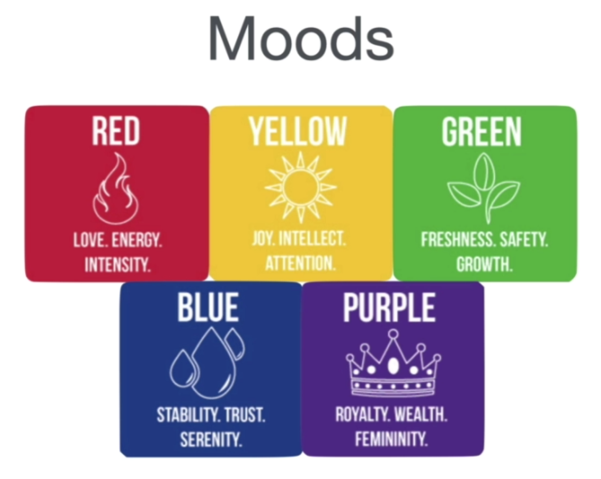
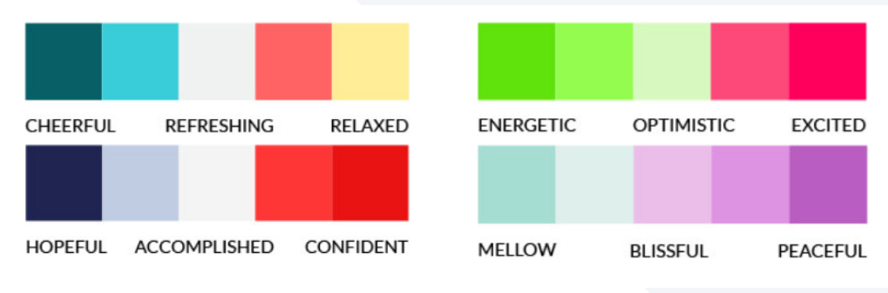
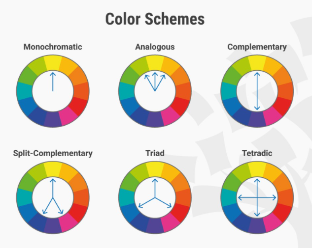
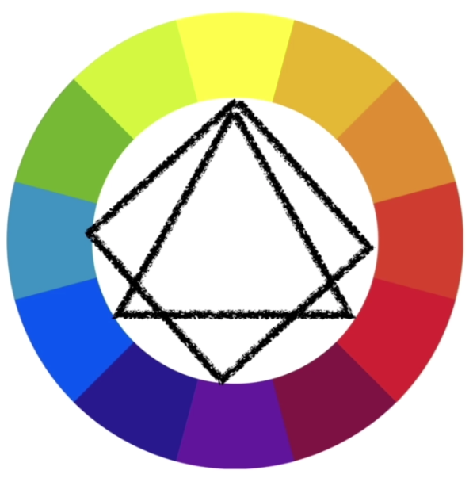
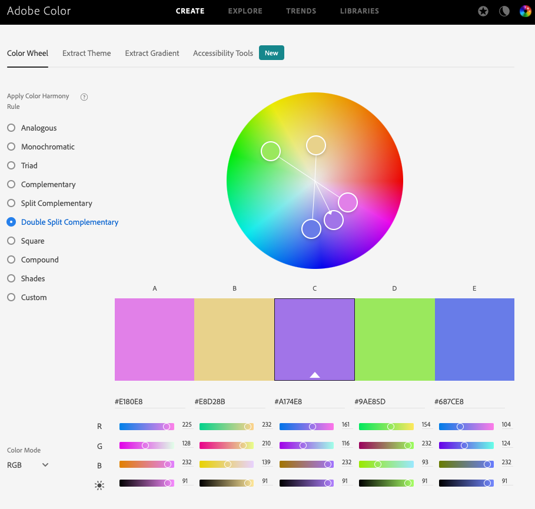

# Web Design Tips

### Topics Covered

1. Web Design Introduction

### Web Design Introduction

* Design websites to look beautiful so that it can be loved by the user.
* Design websites to work how user wants it to.
* You only have 3 seconds to make an impression.
* Design is one of the cheapest ways to make company or product look expensive.
* Makes an improvement on the value of the company or product.

* Four Pillars of Good Web Design
  1. Color Theory
  2. Typography
  3. User Interface Design
  4. User Experience Design

### Color Theory

* The art and theory of picking the right colors for your website.
* Colors can help convey a message.
* You need to be aware of the mood of your color palette.

  1. Red - Energitic, intensity
  2. Yellow - Joy, attention grabbing, (too much can hurt users eyes.)
  3. Green - Fresh, safe, good for food
  4. Blue - Serenity, trust, (Banks use blue a lot.)
  5. Purple - Wealth, Royalty, Femininity (Used sometimes to target women)

* **Analogous Colors** are good for: 
    1. Navigation bars
    2. Body of website
    3. Logo
    4. Background
    5. (Not good for standing out)

* **Complementary Colors** are good for:
    1. Standing out, Make colors pop
    2. Clashing palette
    3. Good for Logos
    4. Good for Icons
    5. (Not good for styling text)

* **Adobe Color** Lets you play with color combinations and the color harmony rule. Allows you to pick the 

### Typography

* 