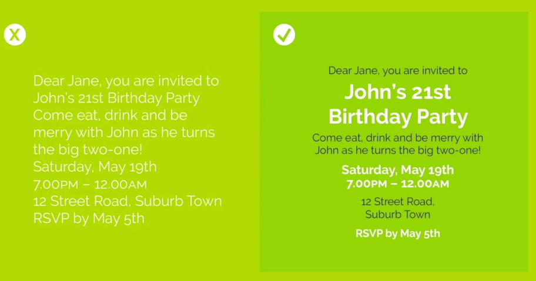
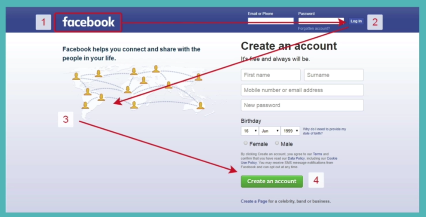

# Web Design Tips

Research Notes on smart Web Design.

### References

1. [**Adobe Color** - for Color Picking](https://color.adobe.com/create/color-wheel)
2. [**Collect UI** - for Color Picking](https://collectui.com/)
3. [**Dribble** - for Inspiration](https://dribbble.com/)
4. [**Color Hunt** - for Inspiration](https://colorhunt.co/)
5. [**Daily UI** - for Design Practice](https://www.dailyui.co/)
6. [**Canva** - for Design Practice](https://www.canva.com/)
7. [**Loremipsum** - for Design Practice](https://loremipsum.io/)

### Topics Covered

1. **Web Design Introduction**
2. **Color Theory**
3. **Typography**
4. **UI Design**
5. **UX Design**
6. **My Own Process of Designing**

### Web Design Introduction

* Design websites to look beautiful so that it can be loved by the user.
* Design websites to work how user wants it to.
* You only have 3 seconds to make an impression.
* Design is one of the cheapest ways to make company or product look expensive.
* Makes an improvement on the value of the company or product.

* Four Pillars of Good Web Design
  1. Color Theory
  2. Typography
  3. User Interface Design
  4. User Experience Design

### Color Theory

* The art and theory of picking the right colors for your website.
* Colors can help convey a message.
* You need to be aware of the mood of your color palette.

  1. **Red** - Energitic, intensity
  2. **Yellow** - Joy, attention grabbing, (too much can hurt users eyes.)
  3. **Green** - Fresh, safe, good for food
  4. **Blue** - Serenity, trust, (Banks use blue a lot.)
  5. **Purple** - Wealth, Royalty, Femininity (Used sometimes to target women)

* **Analogous Colors** are good for: 
    1. Navigation bars
    2. Body of website
    3. Logo
    4. Background
    5. (Not good for standing out)

* **Complementary Colors** are good for:
    1. Standing out, Make colors pop
    2. Clashing palette
    3. Good for Logos
    4. Good for Icons
    5. (Not good for styling text)

* **Adobe Color** Lets you play with color combinations and the color harmony rule. Allows you to pick the 

### Typography

* Fonts could make design look professional
* Fonts could convey a mood

* Serif Family - (Have feet) (Inspire by marble carving)
* Serif looks - Serious, Authoritative, Older, Legal
    1. Old Style (Old Mood)
    2. Transitional (In Between)
    3. Modern (New Mood)
* If you want Authoritative (San serif) then if you want newer pick something more modern. (Didot)

* Sans Serif - (No feet) (Perfect right angle)
* Sans Serif - Friendly, Approachable, novel non-contemporary, Straightforward
* Humanist typeface = Highly readable
* Pleasant to read
* Use easy to read on example = (Sales pitch, want user to read as much as possible)
* Use only two fonts in one design or at least one section
* **Finding fonts**: Find fonts that have similar moods

### User Interface Design

1. Hierarchy
2. Layout
3. Alignment
4. White space
5. Audience

* Use hierarchy with font to have user read most important information you want them to read first 

* Use hierarchy with color to separate importance

* Use hierarchy with size of font and boxes 
* Use hierarchy with layout of website
* 40 to 60 Characters per line

* All of this helps user get through more of the website
* Alignment helps make sites look professional

* Inject white space around elements
* White space elevates, makes site look clean

* Think about the audience and what would appeal to them

### User Experience Design

* Un-intrusive and Invisible
* Lets you do your thing
* Feels like everything is easy
* Feels like everything is effortless

1. **Simplicity** Not Overwhelming and Content can be differientiated
2. **Consistency** (EX: Don't create 3 different Nav Bars)
3. **Reading Patterns** (Use the F-Layout or Z-Layout)

4. **All Platform Design** (Responsive)
5. **Don't Use Your Powers for Evil** (Dark Patterns)

### My Process (Draft)

1. Think about UX
   1. What should be big
   2. Colors easy on the eyes
   3. Font type easy to read
   4. Is it easy to do what it's meant to do?
   5. Wire frame it
   6. Content alignment
   7. Play Around

2. Think about Audience
   1. Colors
   2. Art Patterns
   3. Images
   4. Font type matters
   5. Play Around

3. Finally
   1. Is the design pattern consistent?
   2. Is it responsive?